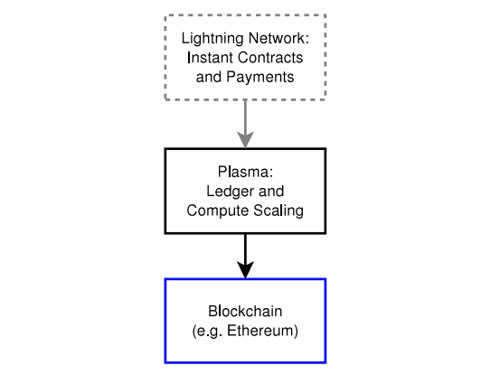

# 설계 스택과 스마트 컨트랙트

역사적으로, 많은 사람들은 블록체인이 총액 결제 시스템(결산 시스템)과 같은 거래 결제 방식에 가장 잘 적용될 것이라고 믿었습니다. 그러나, 총액 결제 시스템(결산 시스템)에 블록체인을 적용하는 것은 확장성에 어려움이 있습니다. 결제 채널 네트워크인 Lightning Network와 같이 여러 결제를 묶어 확정하는 디자인(Net settled designs)은 참가자 간에 거의 무제한 지급을 허용하도록 구조를 변경 했습니다. 채널이 블록체인에 묶여서 있어(net-settled) 트랜잭션 용량이 크게 증가합니다. 이러한 채널 네트워크를 통해 지급은 라우팅 될 수 있습니다.

이 구조는 효과적이고 즉각적인 지불을 가능하게 합니다. 이것은 빠른 송금을 요하는 지불에 도움이 될 뿐만 아니라 컨트랙트에도 도움이 됩니다.

플라즈마는 자식 체인에 대한 트랜잭션이 신속하게 컨펌될지라도 최종 확정이 빠르게 되도록 설계되지 않았습니다. 최종 확정되기 위해서는 루트 블록체인에 대한 최종 승인이 필요합니다. 채널은 로컬 영역에서 빠른 지급 및 계약의 확정을 위해 필요합니다.

스마트 컨트랙트의 경우, "free option problem"이 있으며, 스마트 컨트랙트 제안의 수신자(두번째 또는 마지막 서명인)는 그것을 시행하기 위해 계약서에 서명하고 브로드캐스트 해야 합니다.- 그 기간 동안 컨트랙트의 수취인은 그것을 자유로운 옵션으로 간주할 수 있는데 만약 활동이 그들에게 흥미를 유발하지 않는다면 계약에 서명하기를 거부할 수 있습니다. 이는 신뢰할 수 없는 당사자를 다룰 때 스마트 컨트랙트가 가장 효과적이기 때문에 상황을 악화시킵니다. (상대방에 대한 위험을 감소시켜 그에 따른 정보비용의 최소화시키기 때문에).

플라즈마는 그 자체로 이 문제를 해결하는 것이 아닙니다. 왜냐하면 블록체인에 상호작용 프로토콜에 대한 첫 번째와 두 번째 서명 단계에 대한 계산의 보장이 없기 때문입니다.

라이트닝을(플라즈마 상단의 라이트닝을 포함하여) 사용하면, 합리적인 로컬 영역의 확정(finality)을 통해 상당히 빠른 속도로 업데이트할 수 있습니다. 마지막 당사자에게 선택권을 부여하는 단일 지불 대신에, 지불을 많은 작은 지불로 분할 할 수 있습니다. 이렇게 하면 free option을 분할된 양만큼 최소화 할 수 있습니다. 스마트 컨트랙트의 두 번째 당사자는 분할된 조각의 양에 대한 free option을 가지고 있기 때문에 그 값이 최소화됩니다.

위의 사례에서, 플라즈마는 최소한의 루트 체인 상태 확정으로 원장을 업데이트할 수 있으므로, 라이트닝은 신속한 금융 결제/계약을 위한 제1의 인터페이스 레이어가 될 수 있습니다.

그림 9: 컨트랙트 및 지불에 대한 심판을 담당하는 계층인 루트 블록체인이 있습니다. 컨트랙트 자체는 루트 블록체인에 위치합니다. 플라즈마 체인에는 현재의 원장 상태가 저장되어 있으며, 이 상태는 루트 블록체인에 상환되고 다시 복구시킬 수 있습니다. 자금을 되찾기 위한 위조 증명이 존재합니다. 플라즈마는 중첩된 플라즈마체인 세트를 나타내어 최소한의 트랜잭션으로 자금을 인출할 수 있도록 해 줍니다. 상단의 라이트닝 네트워크는 플라즈마 및 블록체인에 대한 즉각적인 결제가 가능하게 합니다.

# 샤딩에서 가장 중요한 문제는 정보

분할된(sharded) 데이터 세트로 인해, 개별 파편(shard)이 정보 공개를 거부할 위험이 있습니다. 이는 위조 증명을 하는 것을 불가능하게 만들 것입니다.

우리는 다음 세가지 전략을 사용하여 이 문제를 해결하려고 합니다. :

1. 블록의 전파를 장려하는 새로운 PoS 매커니즘
이 메커니즘은 인센티브의 올바른 작동에만 전적으로 의존하지 않습니다. 대신 이는 결함 있는 행동을 상당히 줄일 수 있습니다.

2. 정확한 인출 증명을 위해 상당히 인출 시간에 지연이 발생
개인은 블록체인을 자주 지켜볼 필요가 없으며 상위 플라즈마 체인에 대한 위조는 루트제인에 같은 플라즈마 체인의 어떤 정직한 사용자에 의해 예방할 수 있습니다. block withholding 이벤트가 발생할 경우, 플라즈마 체인은 증거를 통해 즉시 자금을 차단할 수 있기 때문에 부정한 인출 증거를 제출하는 공격자를 막을 수 있습니다. 공격자가 한도를 초과하여 자금을 인출하려고 하여 더 많은 자금이 잠기(locked)는 경우에, 플라즈마 체인을 공격한 사람은 그들의 예치금을 잃게 됩니다.

3. 어떠한 부모 체인이든 트랜잭션을 전파할 수 있는 자식 체인을 생성 가능
이런 이유로, 네트워크상의 참여자들은 자식 체인에 거래를 제출하기를 원할 것입니다. 이는 루트 블록체인에서 높은 거래 수수료를 지불할 필요 없이 작은 자금의 전송이 가능해지므로 경제적 효율을 창출합니다. 따라서 사람들은 상당한 가치의 자식 체인을 만들어 내도록 장려됩니다. 그러나 근본적인 블록체인 트랜잭션 수수료에 포함되지 않는 매우 적은 잔액을 가지는 개인에 대한 체인 선택과 관련하여 평판에 대한 약간의 가정이 있지만, 이는 깊이 중첩된 체인을 통해 완화됩니다. 이 보안 모델은 플라즈마 체인의 주요사항입니다.
