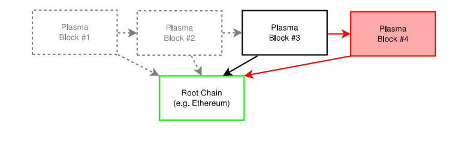
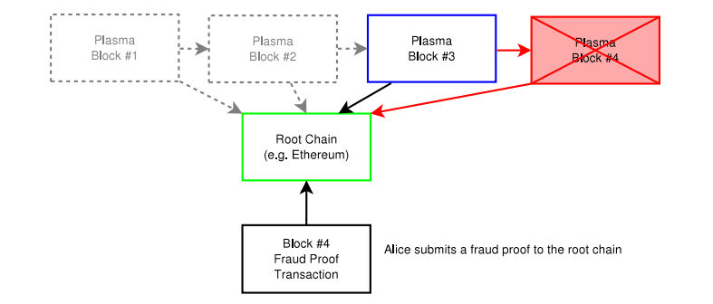
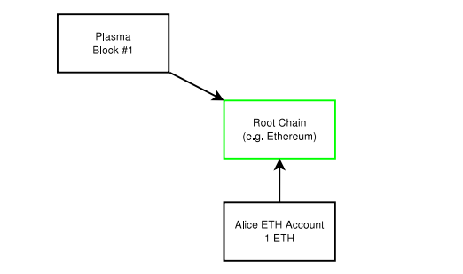
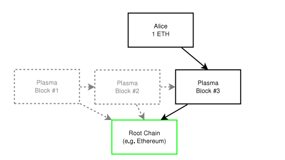

# 다중 오프체인 상태

플라즈마의 주 목적은 사용자들이 블록체인의 순수 코인/토큰 자금을 유효한 온-체인상태가 아니더라도 유지할 수 있는 방법을 만드는 것입니다. 플라즈마는 on-chain과 off-chain의 경계를 허물기 시작 했습니다 (예. On-chain이나 off-chain의 부분이 될 수 있다?).

Off-blockchain 다중(multiparty) 채널의 확립에는 두 가지 일반적인 문제가 있습니다. 첫 번째는 시스템에 업데이트가 필요할 경우 사용자 간에 동기화 상태의 업데이트 (또는 국제 규모의 거래 업데이트의 경우)가 필요하며 온라인 상태가 되어야 합니다. 두 번째는 추가되거나 제외되는 모든 참가자들을 나열할 수 있는 채널 내 참가자의 추가 여부를 업데이트 하는 거대한 온-체인을 필요로 한다는 것입니다.

많은 사용자들의 추가나 제외가 유효한 루트 체인 상태의 업데이트 없이 가능한 메커니즘의 개발이 바람직할 것이며, 이로 인해 모든 사용자들의 참여 없이도 내부 상태의 업데이트가 가능하고 그들은 오직 그들의 잔고가 조정되었을 때나 Byzantine 행동이 감지되었을 때에만 참가하면 됩니다.

일반적인 구성은 루트 체인(예: 이더리움)의 스마트 컨트랙트에 표시되고 잔고 유지가 허용되는 자식 블록체인입니다. 스마트 컨트랙에서 잔고는 하위 플라즈마 체인에서 마지막 블록의 잔고에 표시되고 할당됩니다. 이로 인하여 사용자는 잔고를 보여주는 루트 체인의 자식 체인에서 실제 화폐를 가질 수 있게 되고 이것은 조정 기간 후에 출금이 가능해집니다.

이를 가능하게하기 위하여, 거래 장부 용도의 목적으로 UTXO (사용되지 않은 트랜잭션 아웃풋) 모델을 만들었습니다. 이는 꼭 필요한 요구사항은 아니지만, 빠른 출금을 가능하게하기 위한 이유로 사용됩니다. UTXO 모델의 기본은 트랜잭션이 사용되었는지 아닌지와 같은 어떤 특정한 상황의 발생 여부를 간략하게 보여 주기 위함입니다. 이는 머클화된 증명을 위해 표현되며, 비트맵의 형태로 다른 사용자에 의해 간단한 분석을 가능하게 합니다. 즉 스마트 컨트랙트는 루트 체인에 계좌를 가지고 있지만, 플라즈마 체인은 루트 체인 계좌에 보관된 잔고의 배분을 위한 잔고의 UTXO 세트를 유지합니다. 어떤 상태 변화에 대하여 유효한 필요조건이 없는 자식 체인을 위하여, 이 시스템은 복잡하거나 빈번한 상태 변화가 있는 계좌 모델에 적용될 가능성을 가지고 있지만, 상위 주요 블록체인(들)에 블록 공간을 필요로 하게 됩니다.

현재는 하위 플라즈마 체인의 블록을 선택하는 단일 블록 리더를 생각해 볼 수 있습니다. 이러한 개념은 지분증명(Proof of Stake) 세트 또는 미리 정해진 n-of-m 검사자(n-of-m validators)라고 이름 지어진 시스템으로 구현 가능합니다. 하지만, 이 시스템들로는 간결함을 위하여 단일 검사자를 사용했습니다. 검사자의 기능은 트랜잭션을 정렬하는 역할을 하여 블록을 만드는 것입니다. 검사자/제안자는 주 블록체인 계약에 생성되어 있는 위조 증명 기능에 의하여 제한됩니다. 만약 유효하지 않은 상태의 블록을 생성하면, 이 블록을 받는 다른 사용자는 상위 블록체인에서 merkleized 위조 증명 방식을 이용할 수 있으며, 유효하지 않은 블록은 벌칙과 함께 되돌려집니다.

블록들은 잔고를 가지고 있거나 각자의 플라즈마 체인에서 계산/시행을 원하는 사용자를 포함하여 블록 관찰을 원하는 사용자들에게 배포됩니다.

오프 체인 상태에서 잔고를 유지하는 데에는 복잡함이 최소화되지만, 상태 변화나 출금의 경우 굉장히 복잡한 현상이 생기게 됩니다.

## 위조증명

이 자식 블록체인 안에 있는 모든 상태들은 위조 증명 방식을 통하여 시행되는데, 이는 누구나 블록 데이터 유효성을 근거로 유효하지 않은 블록들에 대한 위조 증명을 할 수 있게 합니다.

하지만, 이 구조 방식에서 가장 큰 어려움은 데이터/블록 유효성에 관하여 확실한 증명 방식이 없다는 것입니다.

루트 블록체인(예. 이더리움)에는, 블록 데이터가 유효할 때 모든 상태 변화가 유효함을 입증하는 위조 증명 시스템들이 있습니다. 복잡한 계산 과정을 위해, 상태 변화는 효과적인 검증을 위해 반드시 merkleized 방식을 이용해야 합니다.

추가적으로, 상태 변화는 부당한 방법으로 종료하는 것을 방지하는 zk-SNARKs/STARKs을 통하여도 시행됩니다. Zk-SNARKs 구조는 효과의 극대화를 위하여 SNARKs 반복적으로 필요할 수도 있으며, 그 가능성을 위해 조금 더 심도 있는 연구가 필요할 것입니다. 하지만, 현재 시스템은 SNARKs 없이 작동할 수 있도록 설계되어 있습니다.

그림 10: 모든 사람은 1-4개의 블록들에 블록 데이터를 가지고 있습니다. 블록 4에 커밋된 상태변화는 블록 4에 할당된 merkleized 방식이나 이전 블록의 데이터를 통하여 부정행위를 입증할 수 있습니다.

위조 증명은 모든 상태 변화이 유효하다는 것을 보장합니다. 위조 증명 방식들의 예는 지출 거래의 증명 (현재UTXO에 가능한 잔고), 상태 변화의 증명 (사용 가능한 잔고를 위한 서명 확인 포함), 블록들 간의 포함/제외 증명, 그리고 입금/출금에 관한 증명 들이 있습니다. 일부 조금 더 복잡한 증명 방식은 상호작용을 필요로 합니다. 일반적인 구조는 블록 검증에 기능적인 접근 방식을 취합니다. 이 합의 메커니즘이 솔리티디로 견고하게 프로그램 되었다면, 블록의 머클 증명 기능 당 추가적인 입력 방식이 검증되어야 할 것이며, 결과 값은 검증 값의 유효여부를 리턴하게 됩니다. 그 후 일치하는 합의 검증 코드를 간결한 merkleized 증명 양식에서 처리 가능하도록 간단하게 복제합니다 (위조 증명을 전체 블록에서 처리할 필요가 없게 하도록).

그림 11: 앨리스는 위조 증명을 루트 체인에 제출하기 위하여, 모든 블록의 데이터를 복사합니다. 블록 4가 유효하지 않다고 판단되어 롤백 됩니다. 블록 4의 제출자는 스마트 컨트랙트의 채권을 상실하였으므로 패널티를 받게 됩니다. 현재 블록은 3 (파랑색)이 됩니다. 일정 시간 경과 후, 블록은 확정되며 위조 증명은 제출할 필요가 없게 됩니다. 부정행위가 증명되지 않은 완벽하게 검증된 블록으로만 블록 구조를 만들어야 합니다.

최소한의 증명만 갖는 이러한 구조를 위하여, 모든 블록들은 현재 상태의 merkleized 트리, 지출된 아웃풋의 트리, 거래의 머클 트리, 그리고 바로 전 상태의 변경에 관한 내용 증명을 제공해야 합니다.

위조 증명은 일종의 연합한 사용자들이 패널티없이 부정적인 블록을 만들지 못하도록 보장해준다. 부정적 블록이 감지되고 루트 블록체인 (또는 부모 플라즈마 체인)에서 검증이 될 경우에는, 그 유효하지 않은 블록은 롤백됩니다. 이는 federated-peg 비트코인 사이드체인에 상태 변화의 취약점을 해결하는 비잔틴 행동에 대항하는 각각의 참가자들에게 보상을 줌으로서 이러한 행동을 장려합니다.

그 결과로는 블록 데이터에 접근이 가능한 관측자들이 무효한 상태 변화를 증명할 수 있는 기회를 제공함과 동시에 높은 확장 가능 상태 변화가 플라즈마 블록체인에서 가능해 진다는 것이다. 즉, 주 루트 체인에서 정기적인 약속만으로 하위 체인에서도 입출금이 가능해 진다는 것이다.

## 입금(deposit)

루트 체인으로부터의 입금은 마스터 컨트랙트로 직접 보내어집니다. 계약(들)은 현재 상태에 대한 의무, 위조 증명으로 인한 무효화에 관한 패널티, 그리고 출금 절차에 관한 추적을 할 의무가 있습니다. 자식 플라즈마 체인은 루트 블록체인의 완벽한 검증자 이므로, 입금 절차는 반드시 이중 잠금 장치를 이용하여 처리되어야 합니다.

입금 절차는 목적지인 자식 체인을 명확하게 하기 위하여 목적지 체인의 블록해시 정보를 반드시 포함하여야 하며, 코인이 복구 불가능하도록 다중 처리 시스템을 이용하여 수행하여야 합니다.

그림 12: 앨리스는 ETH 계좌에 1 ETH를 가지고 있습니다다. 그녀는 1 ETH를 플라즈마 블록체인에 보내기를 원합니다. 그녀는 플라즈마 컨트랙트로 그것을 보냅니다.

1. 코인/토큰 (예, ETH or ERC-20 토큰) 들은 루트 블록체인의 플라즈마 컨트랙트로 보내어집니다. 코인은 일정 시간 동안에는 challenge/response를 위하여 복구가 가능합니다.

2. 플라즈마 블록체인은 입금 거래의 증명 정보를 포함합니다. 이 때, 플라즈마 블록체인은 트랜잭션이 입력되었으며 lock-in 트랜잭션 또는 입금자로부터 처음 사용 이벤트가 일어난 후에 코인이 사용 가능하다는 사실을 인식하게 됩니다. 이 절차가 수행 될 때에, 블록체인은 인출 절차를 허가되었다는 사실을 확인하게 됩니다. 하지만, 이때는 예금자가 위조 증명을 만들어 낼 수 있는 충분한 정보를 가지고 있다는 확신이 없으며, 그러므로 아직 예금자는 책임이 없습니다. 이 블록은 상태 트리 구조, 비트맵, 트랜잭션 트리 구조에 추가적인 요소를 포함하고 있으므로, 간략한 수정 증명 방식이 포함되어 있습니다.

3. 예금자는 2단계에 체인의 약속을 봤다는 내용을 포함하는 트랜잭션을 활성화시키며, 자식 플라스마 블록체인의 트랜잭션에 사인을 합니다. 이 단계에서의 의무는 예금자가 잔고를 인출할 수 있는 충분한 정보를 가지고 있다고 증명하는 것입니다.

이 절차 후, 체인은 거래자들이 이 코인들을 취급하며 인출이 간단하게 증명될 수 있도록 할당해 준다는 내용으로 약속하게 됩니다. 제 3단계에서는 사용자가 인출할 수 있다는 정보를 증명하게 됩니다.

그림 13: 앨리스는 이제 플라즈마 블록에 1ETH를 가지게 되었습니다. 그녀는 자금을 확인하였고 블록이 locked-in 되었음을 확인한 것입니다. 자금이 루트 체인의 스마트 컨트랙트에 유지되고 있으나, 이 특정 플라즈마 블록체인(상태 변화, 예 : 다른 사용자나 스마트 컨트랙트로 이체하는 것)에서 장부 기록은 루트 블록체인의 비용을 들이지 않고 생성될 수 있습니다.

예금자가 제 3단계를 거치지 않을 경우에도, 예금자가 루트 블록체인에서 인출을 시도할 수 있습니다. 예금자는 확인되지 않은 인출을 요구하게 되는 것이며, 플라즈마 블록체인의 잔고가 잠겨 있으며 예금자가 승인을 했다는 위조 증명을 네트워크상의 다른 사람이 확인 할 수 있을 때까지 긴 시간동안 기다려야 합니다. 특별한 부정행위의 증거가 발견되지 않는다면 예금자는 미확인 된 잔고를 인출할 수 있게 됩니다. 이 인출 방식은 비-비잔틴 행동을 위하여 어마어마한 양의 루트 체인 연결을 필요로 하게 됩니다.

## 거액 인출과 비트맵 방식의 상태

이 시스템의 주요 쟁점은 상태의 검증이 불가능하다는 것입니다.

상태 트랙잭션의 간결화를 최대화 할 수 있도록 하기 위하여, 아웃풋은 선택적으로 비트맵 방식으로 표현될 수도 있습니다. 이는 루트 체인에서 막대한 비용이 발생 할 수 있는 인출 증명을 위하여 필요한 절차입니다. 이 구조의 목적은 플라즈마 체인에서 소액의 잔고를 유지할 수 있게 해줍니다. 이러한 소액 잔고들은 루트 블록체인의 계약에 예약되어 유지되지만, 완벽한 거래 장부는 블록체인에 저장되지는 않습니다. 완화되어야 할 주요 공격은 타당하지 않은 블록(루트 체인에 연결된)에 보유됩니다. 시스템이 타당하지 않은 상태 변화를 감지할 경우에는 사용자들이 대량으로 종료(exit)하게 됩니다.

비트맵 구조에서 인출은 종료 하고자하는 서명된 거래의 비트맵을 포함합니다. 정보의 정확성을 위하여 스마트 컨트랙트에 의하여 수행되는 게임/프로토콜 구조가 만들어졌습니다. 비트맵 방식은 사용자들이 어떤 아웃풋이 사용 될지 추론할 수 있도록 보장해줍니다.

이 방식은 비트맵을 사용하므로, 소규모 잔액의 효능을 최대화하기 위하여 사용되지 않은 거래 결과 데이터 구조 (UTXO)에 상태가 표시 되는 것을 필요로 하게 됩니다. 사용된 상태는 간결하게 증명될 수 있으며, 대량의 상태 변화 세트는 명확하게 실행됩니다. 미리 정해진 합의 기간 후에 비트들은 재사용 될 수 있습니다.

높은 보장은 비용이 비싸고 낮은 보장은 저렴한 차이가 있습니다. :

1. 루트 블록체인의 장부 상태
2. 플라즈마의 장부 상태, 온-체인 단일 거래 실행으로 경제적으로 실행 할 수 있음
3. 플라즈마의 장부 상태, 비트맵을 이용하여(1-2 비트 비용으로) 경제적으로 실행 할 수 있음
4. 플라즈마의 장부 상태, 루트 블록체인의 비트맵을 이용한 경제적으로 실행 불가능함. 1-2 비트 대량 인출의 비용이 너무 높은 경우.

루트 체인에서 실행할 수 있는 잔고를 가지고 있는 사용자들은 UTXO 비트맵 방식의 포맷을 반드시 실행할 필요가 없습니다. 하지만 루트 블록체인에서 1-2 비트 트랜잭션 비용이 충분히 낮을 경우에만 실행이 가능합니다.

4번째 타입의 경우에도 (대량 인출을 위한 1-2비트 온 체인 비용이 너무 높은 경우), 시스템은 회복할 수 있게 디자인 되었다 (알려진 엔터티가 안정적일 것이라는 가정 하에). 이 문서의 후반부에는 대량 인출을 경제적으로 실행할 수 있는 많은 공간을 만들 수 있는 블록체인의 계층 구조를 설명할 것이다. 추가적으로, 4번째 타입에서 거래의 총 가치가 현저하게 토큰의 가치보다 작을 경우 잔고를 공격 하는 데에 너무 큰 비용이 이론적으로 발생하게 되어 토큰 소지자들은 명성에 피해를 입게 될 것이다.

## 상태변화

기본적으로, 플라즈마 체인의 상태 변화는 입금절차와 같이 비슷한 다단계 절차로 운영됩니다. 이는 사용자가 상태 변화를 제공할 수 있도록 정보를 얻을 수 있게 합니다. 그러나 입금 구조와는 달리 거래가 승인되고 블록에 포함이 되면, 참가를 해야만 한다는 약속을 하게 됩니다. 이러한 이유 때문에, 상태 변화는 서명, 상태 업데이트 (예, 목적지, 수량, 토큰, 그리고 다른 관련된 상태 데이터), 그리고 만료를 위한 일종의 TTL과 특정 블록에 약속 등을 포함하여야 합니다. 이 TTL은 절대적으로 필요한 것은 아니지만, 역방향 종료 조건을 알 수 있는 종료 증명(exit proofs) 구조 시스템을 만들기 위하여 시간과 연계되어야 합니다. 물론, 이미 증명된 거래는 TTL을 포함할 필요가 없습니다. 재배치와 관련된 인출에 관한 liveness 추정은 이미 있었으며, 약한 liveness 가정은 이 구조와 함께 가정됩니다. 블록의 계약은 플라즈마 체인에서의 거래가 그 시점에서 관찰되며, 증명과정이 실행되며, 최종 결과물의 사용이 이루어지는 블록 다음에 위치되는 것이 알려진 소비자에 의하여 연계됩니다.

빠른 최종 승인을 위한 multi-phase 계약은 다음과 같이 이루어집니다:

1. 앨리스는 플라즈마 체인에 있는 그녀의 아웃풋에서 같은 플라즈마 체인의 밥에게로 보내고자 합니다.(블록체인에 자세한 트랜잭션 기록의 제출 없이) 그녀는 플라즈마 체인에 그녀의 아웃풋 중 하나를 사용하고자 하는 거래내용을 생성하고, 승인하며, 그리고 거래를 브로드캐스트합니다.

2. 플라즈마 체인의 검증자에 의하여 이 거래는 블록에 포함됩니다. 데이터의 헤더는 루트 블록체인이나 부모 플라즈마 체인에 블록의 형태로 포함되며, 최종적으로 루트 블록체인에 연계되고 보증됩니다.

3. 앨리스와 밥은 밥이 거래내용과 블록을 확인했다는 승인과 거래내용을 확인합니다. 이 확인 사실은 서명되며 다른 플라즈마 블록에 포합 됩니다.

느린 최종 승인 절차에서는 첫번째 과정만 발생합니다.

승인이 일어난 후, 그 거래는 최종승인(finalized) 된 것으로 간주된다. 3번째 과정이 존재하는 이유는 사용자들(앨리스와 밥)이 유효한 블록을 확인하는 것을 보장하기 위해서입니다. 이 3번째 과정은 필요한 절차는 아니지만, 최종 승인까지 엄청난 지체 현상이 발생합니다. 트랜잭션과 관련된 모든 사용자들에 의하여 블록의 검증과 정보의 유효성이 최종 승인이 날 때까지 트랜잭션은 보여져서는 안 된다는 근거를 따릅니다.

첫 번째 과정 후 블록이 보류되는 경우 앨리스는 그녀의 트랜잭션 사용여부를 확인하기 어렵습니다. 거래가 블록에 포함되고 (거래가 보류되던 아니던), 3단계가 완료되지 않았을 경우 미확인(unconfirmed)되었다고 간주됩니다. 그러므로 앨리스는 블록의 최종승인(finalized) 전에 루트/블록체인에 제공된 그녀의 인출 메세지를 승인하지 않았다면, 잔고의 인출이 가능합니다. 블록의 최종 승인 후에는 앨리스는 잔고의 인출이 불가능해지며, 블록은 밥에게 전송되었다고 가정 됩니다. 블록이 최종 승인 전에 (첫번째와 두번째 과정 사이) 보류된다면, 앨리스와 밥은 이 상황을 확인할 수 있으며 앨리스는 미 승인된 잔고를 인출할 수 있습니다. 블록들이 2번째 과정 후와 3번째 과정 전 단계에서 보류가 된다면, 밥은 잔고의 인출에 관한 충분한 정보를 가지고 있다고 추정할 수 있습니다. 하지만, 앨리스와 밥 모두 지급에 관한 관계가 없기 때문에, 이론적으로 두 사용자들이 자금을 주장 할 수 있는 정보의 유효성에 따라서 완료되지 않은 상태로 취급됩니다. 두 사용자가 3번째 단계를 승인할 경우에는 최종 승인이 이루어 진 것으로 여겨집니다. 특히 서명이 온-체인에서 입증할 수 있게 관찰될 때에는 이 단계가 완료된 후에 Pay-to-contract-hash의 시행이 일어납니다. 만약 한 사용자가 승인을 거절하거나 블록이 보류가 되면, 상환 증명을 위한 조건부 상태가 됩니다. 모든 상태들은 결국 머클 증명방식을 통하여 체인에 연계되므로, 최종 승인 후 지급 관련 실행이 입증되고 이행 되는 것과 같이 pay-to-contract-hash에 관한 의존도가 약해집니다.

제 3단계 절차에서는 두 사용자의 서명 대신에 스마트 컨트랙트에 따라 조건부 상태가 되는 것을 인지하여야 합니다. 예 : HTLC 원상 공개에 따른 조건부 상태. 이는 멀티-체인이나 멀티-트랜잭셕 축소를 가능하게 합니다. 이러한 기능을 사용하기 원한다면, 컨트랙트를 만드는 과정이 복잡해질 수 있으며, 높은 수준의 프로그래밍 과정이 필요할 수 있습니다.

## 루트 체인에 주기적인 이행

플라즈마 체인은 블록체인의 정렬을 할 수 있어야 합니다. 플라즈마 체인에는 블록 안에 정렬 절차가 있기는 하지만 그 블록들은 검증되지 않았고 자체적으로 정렬이 불가능합니다. 그래서 루트 블록체인에서의 약속이 필요한 것입니다. 플라즈마 체인은 그 블록 헤더를 루트 체인에 공개하고 그 헤더는 위조 증명 방식에 의하여 시행 됩니다. 만약 부정한 헤더가 유효한 데이터와 함께 공개가 되면, 다른 사용자가 위조 증명과 약정을 공개할 수 있으며 그 블록은 공개자에게 패널티를 부여하고 블록을 롤백 시킵니다.

이 약속은 후에 실제 주문에 애매한 절차가 없게 만들어 줍니다. 애매한 절차가 생기게 되면, 충분한 위조 증명 정보가 공개되며 패널티가 주어집니다. 일정 시간 후 블록이 최종 승인되며, 그 결과 루트 블록체인에서 제공하던 재-주문이 불가능해지며, 마무리 되게 됩니다.

## 인출

플라즈마 시스템은 순수 코인이나 토큰(예, ETH와 ERC-20 토큰)의 입금을 블록체인을 이용하지 않고도 가능하게 해준다.  그리고 루트 블록체인에 의하여 실행되는 플라즈마 블록체인 내의 상태 변화는 유효한 정보를 제공하게 된다.  유효한 정보의 제공이 불가능 할 경우에는 플라즈마 체인에서 대거 퇴장을 필요로 하게 된다.  마지막으로, 플라즈마 체인에서 간단하게 자산의 인출을 가능하게 해준다.  하지만, 보통 절차에서 주로 간단한 인출절차가 이용된다.

### 단순 인출

간단한 인출 절차는 사용자가 루트 블록체인에 연계된 자산을 인출만 할 수 있게 해 주며 최종적으로는 플라즈마 체인에서 승인된다.

이 문서에서 입금 시스템, 장부 표현 방식, 그리고 상태 변화 디자인은 서술 되었다.  지금까지의 단계에서, 부정행위 증명을 제외하고, 현재 플라즈마 체인의 장부 상태를 루트 체인에 공개한 경우는 없었다.  그럼에도 불구하고 인출 절차에서는 자금이 플라즈마 체인에 유지되고 있으며 출금 가능한 것을 증명할 특별한 검증 절차가 필요하다.

인출 절차는 코인을 루트 체인과 하위 플라즈마 체인에서 대체할 수 있는 절차를 보장해야 하는 가장 중요한 프로세스다.  사용자가 플라즈마 체인에 입금을 할 수 있다면, 상태 변화 (예, 코인의 다른 사용자에게 이전)가 이루어지며, 다른 사용자들은 그 자산을 인출할 수 있게 되며, 코인의 가치는 루트 체인에서 정해진다. 어떤 경우에는, 보안이 루트 체인에 속해 있고, 많은 거래 능력을 가지고 있는 플라즈마 내의 자금이 조금 더 유용할 수 있다.

간단한 인출절차에서는 모든 자산들이 대규모로 연결되어 있어야 하며, 모든 인출 요청은 부정행위 증명 방식과 연결되어야 한다.  현재의 블록 데이터가 유효하다면 제 3자가 플라즈마 블록체인이 사용 가능하며 인출 정보가 검증되었다는 정보를 적은 비용으로 제공할 수 있다.

플라즈마 체인의 모든 사용자들은 특정 계좌에 인출 절차가 진행되고 있지 않음을 업데이트를 통하여 모든 상위 플라즈마 체인들과 루트 블록체인을 검증해야만 한다.  인출이 진행 중인 경우, 그 다음의 블록의 코인/토큰은 사용 불가능 하며, byzantine 행동은 합의를 위반하는 것이며, 부정행위 증명이 되며, 벌칙이 주어지고, 루트 블록체인에서 플라즈마 계약 당 블록의 전환이 이루어진다.

인출은 다음과 같은 단계로 이루어진다;

1. 인증된 인출 거래는 루트 블록체인이나 상위 플라즈마 체인에 제출된다.  인출 금액은 전체 결과물과 같아야 한다 (일부 인출 불가).  여러 개의 결과물을 인출할 수 있지만, 모든 인출은 같은 플라즈마 체인에 속해 있어야 한다.  인출의 한 과정으로서 결과물의 비트맵은 공개되어야 한다.  인출 과정의 한 부분으로서 추가적인 연결이 부정적인 인출 요청에 대한 벌칙을 위하여 수립되어야 한다.

2. 거래의 항의를 이하여 미리 정해진 일정 기간의 시간이 존재한다.  이는 Lightning Network 의 거래 항의 시스템과 유사하다.  이 경우, 사용자가 체인의 결과물이 인출을 목적으로 이미 사용되었다면 (많은 경우, 루트 블록체인에서), 인출은 취소되고, 인출 요청에 관한 연계는 무효화된다.  사용자가 인지한 이 과정은 항의 할 수 있다.  만약 결과물의 부정 행위 증명을 제공한다면, 연계는 무효화 되고 인출은 취소된다.

3. 낮은 레벨의 블록 인증시스템에서는 다른 인출 요청이 일정시간 보류되는 두 번째의 시간 지체가 있을 수 있다.  이는 특정 플라즈마나 루트 체인에 접수된 인출 요청을 실행하기 위해서다.

4. 플라즈마 스마트 계약에 합의된 항의 조정 기간이 루트 또는 상위 체인에서 부정행위 증명 없이 일정 시간 지나게 되면, 인출은 정확하다고 인정되며, 인출자는 자산을 루트/상위 체인에 인출할 수 있다.  인출 절차는 UTXO/계좌 기간에 의거하여 먼저 요청된 순서대로 처리된다.

플라즈마 체인에서, 경제적으로 실행 가능한 범위에서, 보류된 블록에 인출을 요구하는 경우가 있을 수 있다는 것을 알아야 한다.

부정행위 증명은 사용자가 동일한 결과물에 대하여 네트워크 상에 비교적 쉽게 발견할 수 있는 이중으로 인증된 요청을 증명하였을 경우에만 필요로 하게 된다.  Lightning과 다른 채널의 경우, 추가적인 절차가 높은 레벨의 임시적인 절차와 함께 증명되어야 한다. 일반 채널의 경우, 낮은 레벨의 임시적인 인출이 시도되면, 자금은 플라즈마 체인에 유지되며, 정확한 서명과 함께 인출이 가능해진다.  다른 구조적 방식도 가능하지만, 디자인은 플라즈마 체인의 스마트 계약 부정행위 증명 방식을 포함하여야 한다.

일반적인 인출 방식은 느리고 비용이 발생하는 절차이기 때문에, 사용자들은 단일 인출로 합치려고 하거나, Lighting이나 atomic swap을 이용하여 코인을 다른 체인으로 교환하려고 하는 경향이 있다.

### 빠른 인출

빠른 인출 시스템은 간단한 인출 시스템과 동일한 구조를 가지고 있다.  하지만 자산이 atomic swap으로 운영되는 계약으로 보내어 진다.  교환되는 자산은, 약한 시간적 보류와 플라즈마 체인에 존재하는 높은 시간적 보류와 함께, 루트/상위 체인에 저장되는 자산이다.

빠른 인출을 즉각적으로 실행되는 절차가 아니다.  그러나, 플라즈마 체인이 Byzantine (블록의 보류 포함) 이 아닐 때 거래가 완료되는 시간만큼 인출에 걸리는 시간을 대폭 줄여준다.  이러한 이유때문에, 빠른 인출은 블록이 보류되었을 때에는 이용이 불가능하며, 대신에 느린 대량 인출 요청이 필요하게 된다.

빠른 인출은 다음과 같은 단계로 진행된다:

1. 앨리스는 자금을 인출하여 루트 블록체인으로 시간의 지체 없이 이체 하고자 한다.  그녀는 편한함의 대가로 시간적 가치를 지불하고자 한다.  래리 (유동성 공급자)는 이 같은 서비스를 제공하고자 한다. 앨리스와 래리는 인출을 하고 루트 블록체인에 이체하기 위하여 서로 협동하기로 하였다.

2. 자금은 플라즈마 체인의 특정 결과물 계약에 잠겨 있는 상태이다.  이는 전형적인 이체 과정과 비슷한 형태이며, 두 사용자가 거래를 공표하고, 나중에 플라즈마 블록에서 자신들이 거래내용을 확인했다는 계약을 하게 된다.  이 계약의 조건은 계약이 루트 블록체인에 공개되고 승인이 나게 되면, 지급은 플라즈마 체인으로 이행된다는 내용이다.  거래 내용 증명이 제공되지 않을 경우에는, 앨리스는 자금을 회수할 수 있다.  또한 이러한 절차를 HTLC와 같은 구조적 시스템으로 만들 수 있으며, 앨리스는 원상을 생성하고, 그녀가 자금이 이체되고 유효하다고 판단한 후 공개된다.

3. 위의 플라즈마 블록이 승인되고 래리가 자신이 계약의 조건에 맞게 자금을 회수 할 수 있다고 판단되면, 래리는 특정 금액 (그가 받을 금액은 이 서비스 비용보다 작다)을 앨리스가 지급할 수 있는 온체인 계약을 생성한다.

이 예시에서, 유동성 공급자 래리는 교환 과정을 수락하기 전에 반드시 실제 존재하여야 하며 플라즈마 블록체인을 검증해야만 한다.  래리가 플라즈마 체인을 완벽하게 검증 할 수 없을 경우 (또는 루트 체인에 명시된 스마트 계약의 부정행위 검증 방식에 익숙하지 않을 때), 그는 인출을 실행하면 안된다.  만약 래리가 이 체인에 소속되는 자금을 원하지 않고 대신에 루트 블록체인에 자금을 소속되기를 원한다면, 래리는 선행 인출 절차 완료 후 다른 인출 절차를 실행하던지, 인출 자체를 atomic swap을 이용하여 실행할 수 있다.

많은 경우, 자금이 안정화된 플라즈마 블록체인과 유동성 공급자 간 이체를 할 때에 더 비용적인 효과가 크다.  빠른 완료과정이 가능한 Lightning이나 atomic swap 을 통하여 플라즈마 체인간에 이체가 이루어진다.

이것은 atomic 교차-체인 교환 방식이므로, 앨리스와 래리는 상호간의 자금에 대한 사소한 신뢰를 줄 필요가 없다.  앨리스는 루트/상위 체인에 자금을 소유하고 있으며, 래리는 후에 루트/상위 체인에 모든 접근 권한을 가지게 될 것이다.  루트 블록체인의 non-Byzantine 행동을 마무리하고 적은 비용의 유효한 블록을 제공하게 됨으로써, 래리는 플라즈마 블록체인 자체를 신뢰하지 않더라도 그는 자신의 자금을 받을 수 있다는 확신을 가지게 된다.

## 적대적 대량 인출

플라즈마 시스템 내에서 적대적 대량 인출 거래가 있을 때, 프로토콜이 필요하지 않으며, 블록이 보류된 상태에서 그 디자인 자체는 비용적으로 안정화 되게 되어 있다.  한 사용자가 플라즈마 체인 내의 계좌 상태를 이용하기 원한다면, 지급 계층구조와 같은 다른 디자인에 의존할 수 있다.  그리고, UTXO 모델이 이 곳에서 사용되지만 이 시스템은 루트체인이 계좌 모델을 이용중일 때에만 작동을 하게 된다는 것을 알아야 한다.  게다가 대량 인출이 필요 없거나 원하지 않을 때, 플라즈마 체인에 자금을 유지할 수 있도록 계좌 모델을 쓰는 것이 가능해지며 단순 인출만 가능해진다  (순차번호 증가와 함께).

플라즈마 디자인의 주요 관심이 부정행위 증명 방지를 위한 사항과 관련되어 있으므로 (데이터 유효성 부족의 다른 영향), 감지된 데이터의 비유효성을 위한 완화 절차가 필요하다.  플라즈마 체인에서 사용자가 블록의 비유효성을 발견하면, 특정 시간 안에 그 블록에서 긴급히 퇴장해야 한다.  만약 정해진 시간 안에 체인에서 퇴장하지 않을 경우에는 Lighting 에서 부정확한 인출을 항의 하지 않는 결과와 같은 것으로 취급된다.  이 메커니즘은 플라즈마 블록체인의 운영을 수정하는 주요 기능이다.  플라즈마는 사용자가 Byzantine 행동을 블록의 보류를 통하여 인지하였을 때, 사용자가 플라즈마 블록체인에서 퇴장해야 한다는 사실에 의존한다.  이것의 주 원리는 블록이 보류되었는지 아닌지를 루트 블록체인에서 감지가 불가능 하다는 것이다 (사용자가 블록을 할당 받지 못한 것을 주장하거나, 플라즈마 체인이 사용자가 블록이 유효한지 거짓인지 확인 과정을 거부하였음을 주장하거나).  그 결과, 비유효한 블록의 주장에 관한 비용은 일반적으로 현재 상태의 온체인을 공개하는 것으로 가정한다 (Lighting 이 하는 것처럼).  하지만 대량의 블록들이나 상태 변화에서는 이 시스템은 엄청나게 큰 비용이 발생하며, 플라즈마는 누가 이 비용을 지불할지에 대한 불확실성 때문에 이 구조 시스템을 사용하지 않는다.  그 대신에, 플라즈마는 사용자가 플라즈마 블록체인이 블록을 적대적으로 보류하고 나중에 상태 변화 실행에 영향이 있을 것이라고 믿고 이 플라즈마 체인에서 다른 곳으로 퇴장을 서두른다고 가정한다.

그러므로, 블록이 유효하지 않을 때에 한하여, 적대적 대량 인출로 정의하고 플라즈마 체인이 적대적이거나 Byzantine되었다고 가정하는 것이다.  대량 퇴장은 플라즈마 체인의 Byzantine 행동이 많은 시간 경과 후에도 개인의 자산에 영향을 주지 않으며 체인을 손상시키지 않는 것을 보장한다.

SNARKs 를 이용한 추가적인 보안 완화시스템이 후에 쓰일 것을 예상할 수 있으나, 구체적인 디자인은 여전히 해결해야 할 문제로 남아 있다.  이 구조 시스템은 인출 절차에 관하여 SNARKs에 의존하지 않으며 루트 블록체인에 관측자의 정기적인 활성화가 있게 된다.  하지만, 플라즈마 체인 내에서 상태 변화가 이루어지게 됨에 따라서, 플라즈마 체인의 정기적인 관측이 없는 곳에서 자금을 횡령하기 위한 적대적인 블록의 보류를 가능하게 하는 공격이나 Byzantine을 최소화 하고 SNARKs 순환 속성으로 보완을 강화하게 된다.  이러한 경우, 상태 변화를 위하여 SNARKs 증명과 인출을 위한 높은 신뢰도의 SNARKs 증거가 필요하게 된다.  그러나 플라즈마의 주요 목적은 사용자가 체인을 관측하는 상태 변화의 행동을 수정하는 SNARKs에 의존하지 않으며, 스마트 계약은 이 메커니즘을 수정하여 암호화하며, 루트 블록체인에서 인출이 가능하게 함에 있다.  이와 유사한 이점들은 Lightning 네트워크에도 존재하는데, 이는 스마트 계약을 지원하는 제 3의 체인에 의하여 반복적인 SNARKs 증거가 제공될 때에만 오프체인 상태를 수정할 수 있다는 것을 확인 시켜준다.

플라즈마 체인은 강한 보안 시스템으로 보호되는데, 첫 단계의 보안으로 요소들/하드웨어를 보호하게 되며, 두번째 단계로 SNARKs/STARKs가 사용되며, 마지막 단계로 온체인에서 상호작용 게임 방식이 사용 된다.  첫 단계의 보안이 실패하면, 두번째 단계의 보안 시스템이 혁신적인 암호시스템으로 보호하고, 마지막 단계의 상호작용 게임방식이 투명하게 공개된다.  이 마지막 보안 시스템이 적용된 플라즈마를 앞부분에서 제안하였다.

대량 인출은 다음과 같은 방식으로 퇴장이 발생하는 상호작용 게임의 작용과 함께 수행된다.
1. 앨리스는 플라즈마 체인에서 대량 인출을 위하여 다른 사용자와 협업하고 있다.  다방면의 대량 퇴장이 한 번에 발생 할 수 있지만, 그들이 인출 기능을 중복 사용할 수는 없다.  만약 그들이 중복 인출을 하였다면, 대량 퇴장은 그들의 잔고를 업데이트 하고 중복 인출을 시도한 사용자에게는 벌칙이 주어진다.  모든 사용자들은 다른 플라즈마 체인에 자금을 보내기 위하여 서로 협업해야 한다.

2. 퇴장 관리자, 패트는 퇴장을 구조화 하고자 한다.  패트는 최종 목적 플라즈마 체인과 협업하여 자금을 보내고, 대량 퇴장이 마무리 되면 새로운 체인에서 유용 가능한 자금이 자동적으로 인지되는 것으로 계약하였다.

3. 패트는 플라즈마 체인을 정보가 가능한 지점 까지 검증하였다.  이 지점은 거래 항의를 수락할 수 있거나 플라즈마가 최종 승인 (루트 블록체인의 최종 승인과는 다름) 날 때까지의 범위 안에 있어야 하고, 스마트 계약의 조건에 부합되어야 한다.  패트는 새 플라즈마 체인에 미결된 장부 내용을 사용자에게 보여주게 된다.  패트는 퇴장을 원하는 모든 사용자들로부터 서명을 받는다. (위의 앨리스의 예시 포함).  패트는 데이터의 유효성이 최고점에 다다를 때까지 모든 사용자가 퇴장할 수 있는 권한을 가지고 있는 블록체인을 검증한다.  패트는 막대한 연계가 있는 퇴장 거래를 만들게 된다 (스마트 계약의 루트 블록체인에 정의).  패트는 퇴장하는 사용자들에게 비용을 청구할 것이다.

4. 사용자들은 모든 서명들을 다운로드한 후 대량 인출을 다시 승인한다.  이는 패트에게 벌칙이 부과되지 않는 다는 것을 사용자들이 알게 해 주며, 잠기게 된다.  두번째 서명을 제출하지 않은 사용자들은 그들의 비트를 받을 수 없게 된다.

5. 패트는 그 후 다른 퇴장 거래가 있는지 확인하고 필요할 경우, 중복 거래는 삭제하게 되며, 퇴장 거래에 대하여 서명하고 루트 블록체인이나 상위 플라즈마 체인에 공표하게 된다.  중복 퇴장 거래가 발견될 경우, 상위 체인은 그 선행 체인을 받아들인다 (최고 선행된 체인으로 루트 블록체인 까지만). 선행된 거래는 높은 레벨의 선행 체인을 받아들인다.  대량 퇴장 거래 공표 때에, 패트는 다음과 같은 정보가 정확하다고 연계된 검증을 해야 한다: 블록의 검증, 블록 높이에 따른 UTXO 세트, 비 최종승인, UTXO를 위한 비트맵의 merkleized 매핑방식, 인증된 금액 (빠른 증명을 위하여 merkleized 종합 트리 이용), 앨리스와 다른 사용자들의 서명 확인.  MEIT의 한 부분으로서, 패트는 퇴장된 상태의 전체 비트맵을 공개한다.  이는 다른 사용자들이 루트/상위 체인이 퇴장되었고 실행되었음을 검증할 수 있게 해 준다.  MEIT의 마무리는 굉장히 오랜 시간을 필요로 하며, 몇 주가 걸릴 수도 있기 때문에, MEIT는 마지막 수단의 거래가 되어야 한다 (SNARKs를 이용하여 후에 시간이 단축될 수도 있음).
6. 만약 중복된 인출이 있으면, 패트는 비트맵을 업데이트하고 짧은 유예 기간안에 잔고를 인출할 수 있는 선택이 주어진다.

7. 네트워크 상의 모든 사용자는 대량 퇴장 거래 항의 (DMET)와 함께 MEIT의 확인된 데이터에 접근할 수 있다.  그러나, 패트는 다음의 블록이 결과물을 대체하는지를 알 수가 없기 때문에 패트는 다음 블록에서 거래가 사용되어도 벌칙을 받지 않게 된다. (하지만 사용자는 벌칙을 받을 수 있다).  데이터의 접근 도전이 허용되면, 자금은 접근 도전 게임이 완료될 때까지 잠기게 된다.  이 도전은 유예기간 초에 수행되어야 하며, 도전이 검증되지 않으면, 패트는 인출할 수 있는 잔고를 업데이트 하여야만 한다.

8. 어떠한 접근 도전도 없는 경우에는, MEIT의 마무리 완료 기간이 지난 후에 사용자들은 자금을 수령할 수 있게 된다.

플라즈마 체인의 마무리 윈도우 시간은 적어도 한 사용자가 정기적으로 체인을 확인하는 시간이다.  윈도우 시간 마무리 후, 모든 사용자는 플라즈마 블록체인 블록의 데이터 유효성을 획득한다고 가정한다.

사실상, MEIT 가 패트에 의하여 생성되어질 때, 패트는 특정 플라즈마 블록 높이까지 기록을 수정할 것을 확인하며, 각 개별 결과물의 인출에 대하여 서명을 가지고 있음을 확인한다.  확인 기간 후, 결과값의 중복 사용이 있어도 패트는 벌칙을 받지 않게 된다 (블록 보류에 관한것은 패트에게 벌칙을 줄 수 없는 것처럼).

### 대량 인출 항의: 부정확한 인출 시도

앨리스와 같은 사용자가 패트가 그녀의 동의 없이 대량 인출을 시도한다는 것을 알았을 때에는 도전과제를 만들어 무효화 시킬 수 있다.

1. 앨리스는 하나의 비트맵 방식의 필드가 가능함에 따라 패트가 플라즈마 블록체인에서 그녀의 결과물 중 한 곳에서 대량 인출을 시도한다는 것을 알아 차렸다.  앨리스는 대량의 채권과 함께 시도 도전을 공표하였다.  이 채권은 시도 도전은 가능하지 않는다는 내용을 증명하는 것이다.  그녀는 이런 사항을 블록체인에도 공표한다.

2. 시도 도전이 일정 시간 경과후에도 항의 되지 않는다면, 앨리스는 그녀의 채권을 회수 받게 되며 전체 MEIT 는 취소 된다.  패트 또는 다른 사용자들이 그녀의 부정확한 인출 시도의 부정행위 증명을 만들어내면, 시도 도전의 항의가 성립이 되고, MEIT는 유효한 상태가 되고 그녀의 채권은 깎이게 된다.

사용자들은 MEIT의 두번째 단계에 있다는 것을 (네번째 스텝) 증명할 서명이 유효하다는 것을 확신하게 되며, 시도 도전이 부정행위라면 그들은 그 도전을 항의 할 충분한 정보를 가지게 되는 것이다.  제공된 블록의 유효성과 루트 체인의 비검열에 의하여 그들은 벌칙을 받게 됨에 따라, 그에 대한 보상은 도전의 부정행위에 관하여 이루어진다.

### 대량 인출 거래에 관한 승인된 항의

다음 블록에서 대량 퇴장 시작 거래로부터 발생한 결과물의 부적절한 사용이 있을 경우, 패트는 이 사실을 모를 수 있고, 누구도 블록이 보류된 것을 증명할 방법이 없는 것과 같이, 그에게는 벌칙이 부과되지 않는다.

유사한 비트맵 방식 세트의 항의와 같이 다수의 항의가 있을 수 있으나, 그들 모두 대규모 채권과 연결되어야 한다.

어느 사용자라도 대규모 채권과 함께 비트맵/사용범위를 지정할 수 있다. 대규모 채권은 블록 헤더와 연계된 다음 블록에서 코인이 사용될 수 있다는 증명을 하기 위함이다.

하지만, 이러한 항의 절차는 간단하게 승인되지는 않기 때문에 대량 퇴장 거래에 관한 승인된 항의의 도전을 (CEMET) 발행하기 위하여 다른 반복적인 시도 도전이 가능하다.

이 항의에 관한 시도 도전은 다음과 같다:

1. 앨리스는 그녀가 참가하고 있는 곳에서 누군가가 (예. 체인 운영자가 블록 보류를 할 경우) 그녀의 대량 인출에 관한 항의를 시도하고 있다는 것을 알아차렸다.  그녀는 항의제출자가 유효한 사용을 하고 있지 않는 사실을 증명하기 위하여 대규모 채권과 함께 시도도전을 제시하게 된다.

2. 항의 제출자는 이 시도도전에 대하여 일정 시간 안에 응답을 하여야 한다.  항의 제출자가 사용 증명에 관한 내용을 제시하지 못하게 되면, 마지막 서명자 앨리스는 정당하게 되는 것이며, 제출된 항의 내용은 취소된다 (이것이 이중 항의가 받아들여지는 이유다).  항의 제출자가 코인이 사용되었음을 입증하게 되면, 앨리스는 그녀의 채권을 잃게 되며, 그 항의는 계속 유지된다.

## UTXOs의 재활용

결과물의 사용이 마무리 된 후에는 간략함을 위하여 UTXO 비트맵을 재사용할 수 있다.

## 요약

이와 같은 대량 인출 게임의 결과로, 많은 사용자들의 인출의 경우 가장 최적화된 상태인 한 인출 당 1-2 비트의 정보를 소비하는 것이 가능하다.

대량 인출은 블록의 보류가 발생할 경우 필요한 절차이다.  하지만, 이는 많은 비용 발생을 초래할 수도 있다.  이러한 이유로, 루트 체인의 과부하에 의존하지 않는 차선의 전략이 필요하다.

이 구조는 많은 사용자들이 그들의 자산을 하위 블록체인에 유지할 수 있게 해주며, 블록의 정보가 유효하거나, 상태 변화가 일어나거나 (예, 지급), 인출이 가능하거나, 그리고 블록이 보류가 되었을 때 대량 퇴장 (약간의 지체가 있더라도)이 가능할 때, 부정행위 증명을 통하여 상태의 무효화를 시킬 수 있다.
